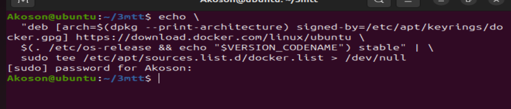
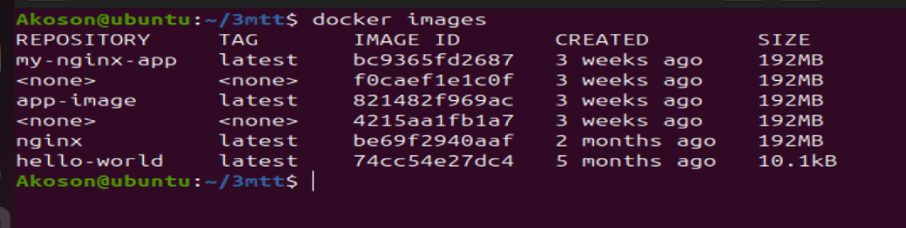

# Docker Introduction and Setup Guide

## Project Overview

### Welcome to your first step into the world of Docker! This guide walks you through the fundamental concepts of Docker, its advantages, and a hands-on approach to getting started on Ubuntu. Docker enables you to build, package, and deploy applications seamlessly across various platforms using containerization.

## Advantages of Containers

### 1. Portability Across Different Environments: Docker eliminates environment mismatch issues, allowing consistent application behavior across systems.

### 2. Resource Efficiency Compared to Virtual Machines: Containers share the host OS kernel, making them lightweight and faster than traditional VMs.

### 3. Rapid Application Deployment and Scaling: Containers can be spun up or shut down quickly, making it easier to manage sudden surges in demand.

## Docker vs. Virtual Machines

### 1. VMs emulate full OS environments, resulting in heavier resource usage and slower performance.

### 2. Docker uses containerization, sharing the host OS kernel to optimize resource usage and enable faster startups.

### 3. Conclusion: Docker is ideal for microservices and scalable applications, while VMs are suitable for isolated environments.

## Importance of Docker

### 1. Technology Impact: Revolutionizes software development by packaging applications and dependencies into portable containers.

### 2. Real-World Benefits: Accelerates development, enhances collaboration, reduces resource waste, and improves software lifecycle resilience.

## Project Goals

### 1. By the end of this guide, you should be able to:

### 2. Understand containers, isolation, and orchestration.

### 3. Learn Docker architecture, commands, and best practices.

### 4. Compare Docker with traditional VMs.

### 5. Ensure consistent application behavior across environments.

### 6. Deploy and scale applications using Docker.

## Step 1: Installing Docker

### We need to launch ubuntu instance, connect to it then follow the steps below.

### Before installing Docker Engine for the first time on a new host machine, its necessary to configure Docker repository. Following this setup we can proceed to install and update docker directly from the repositoey.

## Lets first add Docker official GPG key

### ubuntu 20.04 LTS instance that will host our Docker Engine created created

0

### This linux command that refreshes the package list on a Debian base system, ensuring the latest software information is available for installation

`sudo apt-get update`

### This is a linux command that install essential packages including certificate authorities, a data transfer tool(curl), and the GNU Privacy Guard for secure communication and package verificatiom.

```sudo apt-get install ca-certificates curl gnupg
```

### The command creates a directory (/etc/apt/keyrings) with specific permission (0755) for storing keyring files, which are used for docker's authentification

`sudo install -m 0755 -d /etc/apt/keyrings`

### This download the Docker GPG key file within the APT keyring directory

```curl -fsSL https://download.docker.com/linux/ubuntu/gpg | sudo gpg --dearmor -o /etc/apt/keyrings/docker.gpg```

### This command sets permission for all users on the Docker GPG key filewithin the APT keying directory

`sudo chmod a+r /etc/apt/keyrings/docker.gpg`


## Adding the repository to Apt sources

### The echo command creates a Docker APT repository configuration entry for the ubuntu system, incorporating the system authentification and Docker GPG key and then sudo the /etc/apt/sources.list.d/docke.list> /dev/null" writes this configuration to the "/etc/apt/sources.list.d/docker.list" file.

`echo \
  "deb [arch=$(dpkg --print-architecture) signed-by=/etc/apt/keyrings/docker.gpg] https://download.docker.com/linux/ubuntu \
  $(. /etc/os-release && echo "$VERSION_CODENAME") stable" | \
  sudo tee /etc/apt/sources.list.d/docker.list > /dev/null`
  

### This command install latest version of docker

`sudo apt-get install docker-ce docker-ce-cli containerd.io buildx-plugin docker-compose-plugin`
  
### This command verify docker has been successfully installed.

`sudo systemctl status docker`

### By default, after installing docker it can only be run by root user or using sudo command. To run docker command without sudo run the command below

`sudo usermod -aG docker ubuntu`


## Running the Hello World Container Using the "docker run" Command

### The docker run command is the entry point to execute containers in Docker. It allows you to create and start a container based on a specified Docker image. The most straight forward example is the hello world container, a minimalistic container that prints a greeting message when executed.

`Run the "Hello World" container
docker run hello-world`


When you execute this command, Docker performs the following steps:

1. **Pulls Image (if not available locally)**: Docker checks if the `hello-world` image is available locally. If not, it automatically pulls it from the Docker Hub, a centralized repository for Docker images.

2. **Creates a Container**: Docker creates a container based on the `hello-world` image. This container is an instance of the image, with its own isolated filesystem and runtime environment.

3. **Starts the Container**: The container is started, and it executes the predefined command in the `hello-world` image, which prints a friendly message.

**Understanding the Docker Image and Container Lifecycle**

**Docker Image**: A Docker image is a lightweight, standalone, and executable package that includes everything needed to run a piece of software, including the code, runtime, libraries, and system tools. Images are immutable, meaning they cannot be modified once created. Changes result in the creation of a new image.

- **Container Lifecycle**: Containers are running instances of Docker images.
  - They have a lifecycle: `create, start, stop, and delete`.
  - Once a container is created from an image, it can be started, stop and restarted.


**Verifying Successful Run**

### You can verify if the image is now in your local environment with this command

`docker images`

### If you encounter any issues, ensure that Docker is properly installed and that your user has the necessary permissions to run Docker commands.

### This simple "Hello World" example serves as a basic introduction to running containers with Docker. It helps verify that your Docker environment is set up correctly and provides insight into the image and container lifecycle. As you progress in this course, you'll explore more complex scenarios and leverage Docker for building, deploying, and managing diverse applications.


# Docker Command Reference with Descriptions

## docker run
The `docker run` command is fundamental for executing containers. It creates and starts a container based on a specified image.

`docker run hello-world`

### This example pulls the "nginx" image from Docker Hub (if not available locally) and starts a container using that image.

## Docker PS
The `docker ps` command displays a list of running containers. This is useful for monitoring active containers and obtaining information such as container IDs, names, and status. It List running containers

`docker ps`

### To view all containers, including those that have stopped, add the -a option. List all containers (running and stopped)

`docker ps -a`

## Docker Stop

### The docker stop command halts a running container.Stop a running container (replace CONTAINER_ID with the actual container ID)

`docker stop CONTAINER_ID`

## Docker Pull

### The docker pull command downloads a Docker image from a registry, such as Docker Hub, to your local machine. Pull the latest version of the "ubuntu" image from Docker Hub

`docker pull ubuntu`

## Docker Push

### The docker push command uploads a local Docker image to a registry, making it available for others to pull. Push a local image to Docker Hub

docker push your-username/image-name

### Ensure you've logged in to Docker Hub using docker login before pushing images.

## Docker Images

### The docker images command lists all locally available Docker images. List all local Docker images

`docker images`

## Docker RMI

### The `docker rmi` remove one or more images from your local machine. Remove a Docker image (replace IMAGE_ID with the actual image ID)

`docker rmi IMAGE_ID`

## Summary

### These basic Docker commands provide a foundation for working with containers.  Understanding how to run, list, stop, pull, push, and manage Docker images  is crucial for effective containerization and orchestration.  


# Main Project Implementation and Screenshots

### EC2 Instance dashboard


### Connecting to ec2 instance


### updating ec2 instance


### installing essentiall packages


### crating directory for specifc permissions, download docker GPG key using curl, set read permission for all users on GPG key file within the Apt directory


### echo command creat a docker Apt repository configuration entry



### Install latest version of Docker


### Verify Docker has been successfully install


### Making docker command to run without sudo command. That is adding user Akoson to docker Group


### Running `Hello World` container


### verifying image is in my local machine



### Run a container based on the "nginx" image


### List running containers. We dont have running container


### List running containers including stopped container


### Stopping a running container


### pulling the latest version of ubuntu image with docker pull command


